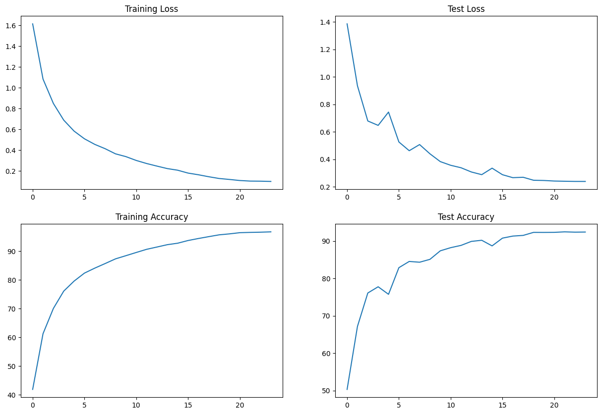

## Session 10 

### Summary
The model was able to acheive an accuracy of 92.4% using 6,573,130 params.

#### Model Summary
    ----------------------------------------------------------------
            Layer (type)               Output Shape         Param #
    ================================================================
                Conv2d-1           [-1, 64, 32, 32]           1,728
          BatchNorm2d-2           [-1, 64, 32, 32]             128
                  ReLU-3           [-1, 64, 32, 32]               0
              Dropout-4           [-1, 64, 32, 32]               0
                Conv2d-5          [-1, 128, 32, 32]          73,728
            MaxPool2d-6          [-1, 128, 16, 16]               0
          BatchNorm2d-7          [-1, 128, 16, 16]             256
                  ReLU-8          [-1, 128, 16, 16]               0
              Dropout-9          [-1, 128, 16, 16]               0
              Conv2d-10          [-1, 128, 16, 16]         147,456
          BatchNorm2d-11          [-1, 128, 16, 16]             256
                ReLU-12          [-1, 128, 16, 16]               0
              Dropout-13          [-1, 128, 16, 16]               0
              Conv2d-14          [-1, 128, 16, 16]         147,456
          BatchNorm2d-15          [-1, 128, 16, 16]             256
                ReLU-16          [-1, 128, 16, 16]               0
              Dropout-17          [-1, 128, 16, 16]               0
              Conv2d-18          [-1, 256, 16, 16]         294,912
            MaxPool2d-19            [-1, 256, 8, 8]               0
          BatchNorm2d-20            [-1, 256, 8, 8]             512
                ReLU-21            [-1, 256, 8, 8]               0
              Dropout-22            [-1, 256, 8, 8]               0
              Conv2d-23            [-1, 512, 8, 8]       1,179,648
            MaxPool2d-24            [-1, 512, 4, 4]               0
          BatchNorm2d-25            [-1, 512, 4, 4]           1,024
                ReLU-26            [-1, 512, 4, 4]               0
              Dropout-27            [-1, 512, 4, 4]               0
              Conv2d-28            [-1, 512, 4, 4]       2,359,296
          BatchNorm2d-29            [-1, 512, 4, 4]           1,024
                ReLU-30            [-1, 512, 4, 4]               0
              Dropout-31            [-1, 512, 4, 4]               0
              Conv2d-32            [-1, 512, 4, 4]       2,359,296
          BatchNorm2d-33            [-1, 512, 4, 4]           1,024
                ReLU-34            [-1, 512, 4, 4]               0
              Dropout-35            [-1, 512, 4, 4]               0
            MaxPool2d-36            [-1, 512, 1, 1]               0
              Linear-37                   [-1, 10]           5,130
    ================================================================
    Total params: 6,573,130
    Trainable params: 6,573,130
    Non-trainable params: 0
    ----------------------------------------------------------------
    Input size (MB): 0.01
    Forward/backward pass size (MB): 8.00
    Params size (MB): 25.07
    Estimated Total Size (MB): 33.09
    ----------------------------------------------------------------

#### Training Status
      Epoch :  0
      Train: Loss=1.2984 Batch_id=97 Accuracy=41.90: 100%|██████████| 98/98 [00:21<00:00,  4.47it/s]
      Test set: Average loss: 1.3858, Accuracy: 5032/10000 (50.32%)

      Epoch :  1
      Train: Loss=0.9645 Batch_id=97 Accuracy=61.27: 100%|██████████| 98/98 [00:19<00:00,  4.97it/s]
      Test set: Average loss: 0.9355, Accuracy: 6716/10000 (67.16%)

      Epoch :  2
      Train: Loss=0.7725 Batch_id=97 Accuracy=70.05: 100%|██████████| 98/98 [00:20<00:00,  4.85it/s]
      Test set: Average loss: 0.6795, Accuracy: 7610/10000 (76.10%)

      Epoch :  3
      Train: Loss=0.6575 Batch_id=97 Accuracy=76.08: 100%|██████████| 98/98 [00:19<00:00,  4.92it/s]
      Test set: Average loss: 0.6475, Accuracy: 7777/10000 (77.77%)

      Epoch :  4
      Train: Loss=0.5079 Batch_id=97 Accuracy=79.56: 100%|██████████| 98/98 [00:20<00:00,  4.78it/s]
      Test set: Average loss: 0.7443, Accuracy: 7575/10000 (75.75%)

      Epoch :  5
      Train: Loss=0.4904 Batch_id=97 Accuracy=82.34: 100%|██████████| 98/98 [00:20<00:00,  4.87it/s]
      Test set: Average loss: 0.5270, Accuracy: 8287/10000 (82.87%)

      Epoch :  6
      Train: Loss=0.3823 Batch_id=97 Accuracy=84.07: 100%|██████████| 98/98 [00:20<00:00,  4.88it/s]
      Test set: Average loss: 0.4634, Accuracy: 8454/10000 (84.54%)

      Epoch :  7
      Train: Loss=0.4120 Batch_id=97 Accuracy=85.67: 100%|██████████| 98/98 [00:20<00:00,  4.74it/s]
      Test set: Average loss: 0.5081, Accuracy: 8433/10000 (84.33%)

      Epoch :  8
      Train: Loss=0.3939 Batch_id=97 Accuracy=87.29: 100%|██████████| 98/98 [00:21<00:00,  4.63it/s]
      Test set: Average loss: 0.4408, Accuracy: 8510/10000 (85.10%)

      Epoch :  9
      Train: Loss=0.3149 Batch_id=97 Accuracy=88.40: 100%|██████████| 98/98 [00:20<00:00,  4.68it/s]
      Test set: Average loss: 0.3841, Accuracy: 8738/10000 (87.38%)

      Epoch :  10
      Train: Loss=0.2000 Batch_id=97 Accuracy=89.51: 100%|██████████| 98/98 [00:20<00:00,  4.75it/s]
      Test set: Average loss: 0.3574, Accuracy: 8822/10000 (88.22%)

      Epoch :  11
      Train: Loss=0.2691 Batch_id=97 Accuracy=90.61: 100%|██████████| 98/98 [00:20<00:00,  4.74it/s]
      Test set: Average loss: 0.3394, Accuracy: 8883/10000 (88.83%)

      Epoch :  12
      Train: Loss=0.2492 Batch_id=97 Accuracy=91.41: 100%|██████████| 98/98 [00:21<00:00,  4.63it/s]
      Test set: Average loss: 0.3086, Accuracy: 8990/10000 (89.90%)

      Epoch :  13
      Train: Loss=0.2556 Batch_id=97 Accuracy=92.22: 100%|██████████| 98/98 [00:21<00:00,  4.64it/s]
      Test set: Average loss: 0.2892, Accuracy: 9020/10000 (90.20%)

      Epoch :  14
      Train: Loss=0.1757 Batch_id=97 Accuracy=92.73: 100%|██████████| 98/98 [00:20<00:00,  4.69it/s]
      Test set: Average loss: 0.3364, Accuracy: 8870/10000 (88.70%)

      Epoch :  15
      Train: Loss=0.2024 Batch_id=97 Accuracy=93.67: 100%|██████████| 98/98 [00:20<00:00,  4.75it/s]
      Test set: Average loss: 0.2889, Accuracy: 9077/10000 (90.77%)

      Epoch :  16
      Train: Loss=0.2138 Batch_id=97 Accuracy=94.37: 100%|██████████| 98/98 [00:20<00:00,  4.74it/s]
      Test set: Average loss: 0.2673, Accuracy: 9132/10000 (91.32%)

      Epoch :  17
      Train: Loss=0.1552 Batch_id=97 Accuracy=95.02: 100%|██████████| 98/98 [00:21<00:00,  4.64it/s]
      Test set: Average loss: 0.2702, Accuracy: 9150/10000 (91.50%)

      Epoch :  18
      Train: Loss=0.1512 Batch_id=97 Accuracy=95.64: 100%|██████████| 98/98 [00:21<00:00,  4.67it/s]
      Test set: Average loss: 0.2486, Accuracy: 9231/10000 (92.31%)

      Epoch :  19
      Train: Loss=0.1317 Batch_id=97 Accuracy=95.98: 100%|██████████| 98/98 [00:20<00:00,  4.67it/s]
      Test set: Average loss: 0.2469, Accuracy: 9230/10000 (92.30%)

      Epoch :  20
      Train: Loss=0.1049 Batch_id=97 Accuracy=96.39: 100%|██████████| 98/98 [00:20<00:00,  4.74it/s]
      Test set: Average loss: 0.2428, Accuracy: 9232/10000 (92.32%)

      Epoch :  21
      Train: Loss=0.1049 Batch_id=97 Accuracy=96.50: 100%|██████████| 98/98 [00:20<00:00,  4.76it/s]
      Test set: Average loss: 0.2414, Accuracy: 9245/10000 (92.45%)

      Epoch :  22
      Train: Loss=0.1025 Batch_id=97 Accuracy=96.57: 100%|██████████| 98/98 [00:21<00:00,  4.60it/s]
      Test set: Average loss: 0.2401, Accuracy: 9237/10000 (92.37%)

      Epoch :  23
      Train: Loss=0.0844 Batch_id=97 Accuracy=96.68: 100%|██████████| 98/98 [00:21<00:00,  4.64it/s]
      Test set: Average loss: 0.2399, Accuracy: 9240/10000 (92.40%)

### Analyze Training, Testing Loss and Accuracy
   