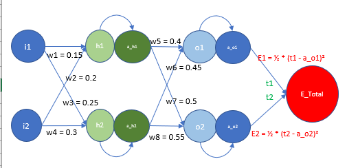
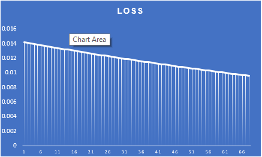
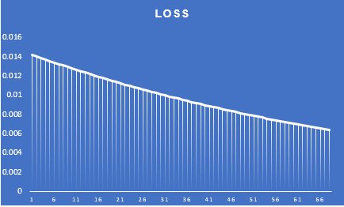
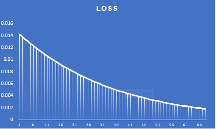
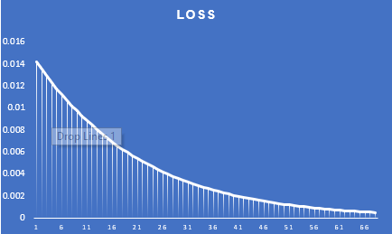
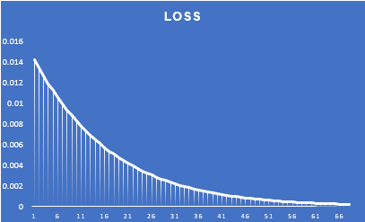
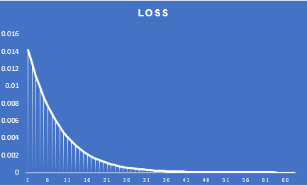

# Session 6 Part1 - ERA-TheSchoolOfAI

### **Sample model architecture**

### **Weight updation process**

Below steps show the weight updation process using backpropagation

**STEP 1 - Randomly initialise weights in neural network**

Before we begin training our neural network, we need to initialize the weights randomly.

        1) h1 = w1*i1 + w2*i2		     # Calculate the value of neuron h1 using weights w1, w2, and inputs i1, i2
        2) h2 = w3*i1 + w4*i2		     # Calculate the value of neuron h2 using weights w3, w4, and inputs i1, i2
        3) a_h1 = σ(h1) = 1/(1 + exp(-h1))	     # Calculate the activated value of neuron h1 using the sigmoid function
        4) a_h2 = σ(h2)		             # Calculate the activated value of neuron h2 using the sigmoid function
        5) o1 = w5*a_h1 + w6*a_h2		     # Calculate the value of neuron o1 using weights w5, w6, and inputs a_h1, a_h2
        6) o2 = w7*a_h1 + w8*a_h2		     # Calculate the value of neuron o2 using weights w7, w8, and inputs a_h1, a_h2
        7) a_o1 = σ(o1)		             # Calculate the activated value of neuron o1 using the sigmoid function
        8) a_o2 = σ(o2)		             # Calculate the activated value of neuron o2 using the sigmoid function
        9) E_total = E1 + E2		     # Calculate the total error by summing E1 and E2
        10) E1 = ½ * (t1 - a_o1)²		     # Calculate E1 using the squared difference between the truth t1 and the predicted a_o1
        11) E2 = ½ * (t2 - a_o2)²		     # Calculate E2 using the squared difference between the truth t2 and the predicted a_o2

**STEP 2  - Perform a forward pass through the network using the weights and the input data**

Now that we have the weights and input features, we can proceed to compute the output of the hidden layer and the predictions of the output layer.

        1) ∂E_total/∂w5 = ∂(E1 + E2)/∂w5			                        # This equation calculates the partial derivative of the total loss (E1 + E2) with respect to w5.
        2) ∂E_total/∂w5 = ∂E1/∂w5					                # Since weight w5 has no influence on E2, this equation simplifies to the rate of change of E1 with respect to w5.
        3) ∂E_total/∂w5 = ∂E1/∂w5 = ∂E1/∂a_o1 * ∂a_o1/∂o1 * ∂o1/∂w5		        # The chain rule is applied to calculate ∂E1/∂w5.
            3.1) ∂E1/∂a_o1 =  ∂(½ * (t1 - a_o1)²)/∂a_o1 = (a_01 - t1)	        # The derivative of ∂(½ * (t1 - a_o1)²)/∂a_o1 is (a_01 - t1).
            3.2) ∂a_o1/∂o1 =  ∂(σ(o1))/∂o1 = a_o1 * (1 - a_o1)					
            3.3) ∂o1/∂w5 = a_h1                                                 # The derivative of ∂(w5*a_h1 + w6*a_h2)/∂w5 is a_h1.
        4) ∂E_total/∂w5 = ∂E1/∂w5 = (a_01 - t1) * a_o1 * (1 - a_o1) * a_h1          # Substituting the values above, we get the final equation.

**STEP 3  - Calculate the loss between ground truth prediction and output from the network**

To evaluate the performance of our network, we compare the output predictions with the ground truth and calculate the loss. A higher loss indicates poorer performance. In the next epoch, we aim to reduce the loss by adjusting the weights in the network accordingly.

        1) ∂E_total/∂w5 = (a_01 - t1) * a_o1 * (1 - a_o1) *  a_h1		   # This equation calculates the partial derivative of the total loss with respect to w5. It is the same as Step 2.4 above.		
        2) ∂E_total/∂w6 = (a_01 - t1) * a_o1 * (1 - a_o1) *  a_h2		   # ∂E_total/∂w6 is the same as ∂E_total/∂w5 since we have the same sets of inputs and outputs.	
        3) ∂E_total/∂w7 = (a_02 - t2) * a_o2 * (1 - a_o2) *  a_h1		   # ∂E_total/∂w7 here, the only things that get replaced are ao1 >> ao2, t1 >> t2, else all remains the same.
        4) ∂E_total/∂w8 = (a_02 - t2) * a_o2 * (1 - a_o2) *  a_h2		   # ∂E_total/∂w7 here, the only things that get replaced are ao1 >> ao2, t1 >> t2, else all remains the same.		

**STEP 4 - Calculate the gradient of the loss with respect to each of the weights**

The partial derivatives can be used to calculate the gradient of the loss with respect to the weights.

        1) ∂E1/∂a_h1 = (a_01 - t1) * a_o1 * (1 - a_o1) * w5								
        2) ∂E2/∂a_h1 = (a_02 - t2) * a_o2 * (1 - a_o2) * w7								
        3) ∂E_total/∂a_h1 = (a_01 - t1) * a_o1 * (1 - a_o1) * w5 +  (a_02 - t2) * a_o2 * (1 - a_o2) * w7								
        4) ∂E_total/∂a_h2 = (a_01 - t1) * a_o1 * (1 - a_o1) * w6 +  (a_02 - t2) * a_o2 * (1 - a_o2) * w8								

**STEP 5 - Adjust the weight of the network based on the gradients**

The network weights are modified by subtracting the learning rate multiplied by the partial derivative of the loss with respect to the weight.

        1) ∂E_total/∂w1 = ∂E_total/∂a_h1 * ∂a_h1/∂h1 * ∂h1/∂w1					
        2) ∂E_total/∂w2 = ∂E_total/∂a_h1 * ∂a_h1/∂h1 * ∂h1/∂w2					
        3) ∂E_total/∂w3 = ∂E_total/∂a_h2 * ∂a_h2/∂h2 * ∂h2/∂w3					

**STEP 6 - Rerun step 1 to 6 again till number of epochs are finished.**

The steps from 1 to 6 are repeated until the specified number of epochs is reached. The shape of the loss function graph can vary significantly depending on the chosen learning rate.

        1) ∂E_total/∂w1 = ((a_01 - t1) * a_o1 * (1 - a_o1) * w5 +  (a_02 - t2) * a_o2 * (1 - a_o2) * w7) * a_h1 * (1 - a_h1) * i1												
        2) ∂E_total/∂w2 = ((a_01 - t1) * a_o1 * (1 - a_o1) * w5 +  (a_02 - t2) * a_o2 * (1 - a_o2) * w7) * a_h1 * (1 - a_h1) * i2												
        3) ∂E_total/∂w3 = ((a_01 - t1) * a_o1 * (1 - a_o1) * w6 +  (a_02 - t2) * a_o2 * (1 - a_o2) * w8) * a_h2 * (1 - a_h2) * i1												
        4) ∂E_total/∂w4 = ((a_01 - t1) * a_o1 * (1 - a_o1) * w6 +  (a_02 - t2) * a_o2 * (1 - a_o2) * w8) * a_h2 * (1 - a_h2) * i2												

### **Initial weights as per excel**

## **Loss Curve at various LR values**

### **Loss Curve at LR = 0.1**

### **Loss Curve at LR = 0.2**

### **Loss Curve at LR = 0.5**

### **Loss Curve at LR = 0.8**

### **Loss Curve at LR = 1.0**

### **Loss Curve at LR = 2.0**

