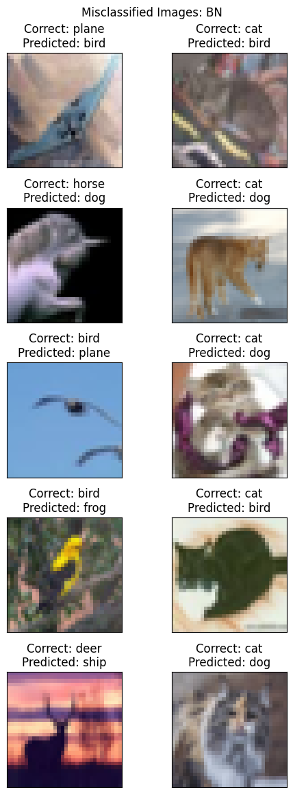
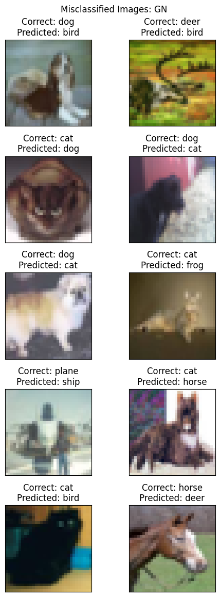
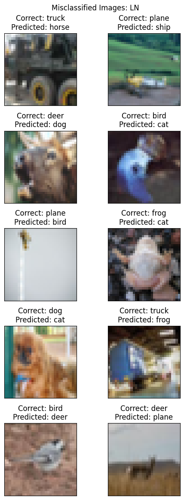
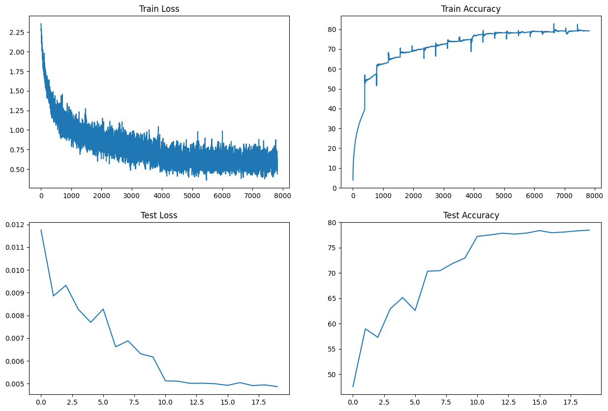
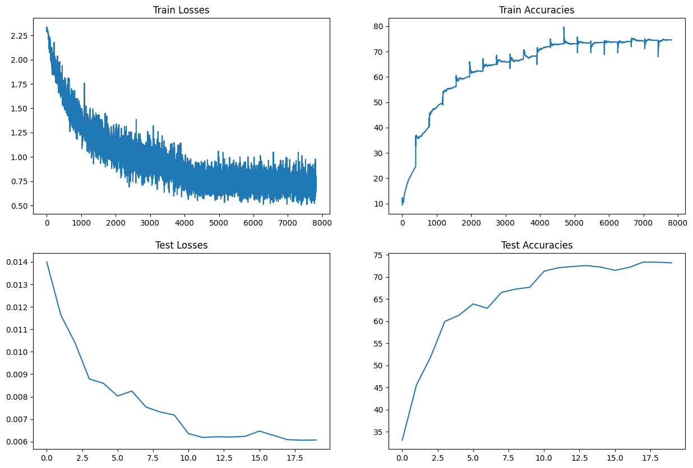
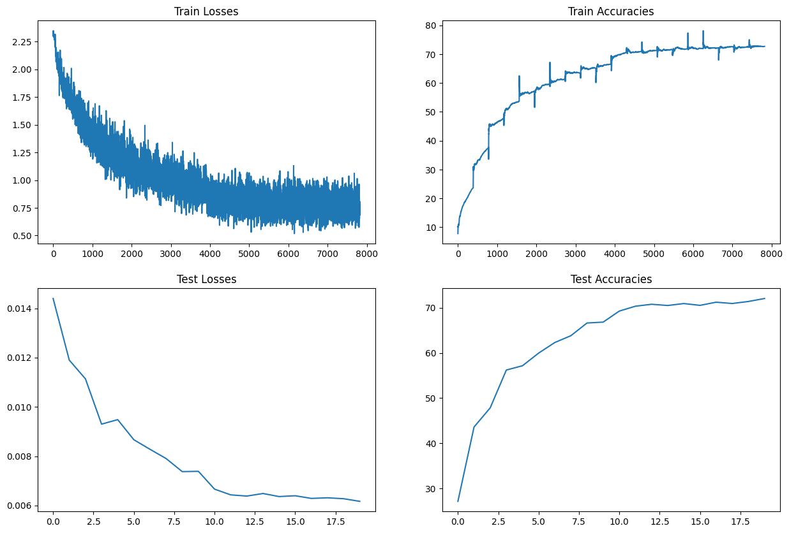

# Session 8 - Normalization Techniques

## Objectives

This project aims to explore different normalization techniques in a Convolutional Neural Network (CNN) using the CIFAR10 dataset. The objectives are:

1. Implement a CNN with the following architecture: C1 C2 c3 P1 C3 C4 C5 c6 P2 C7 C8 C9 GAP c10 (where cN is a 1x1 layer).
2. Keep the total parameter count under 50,000.
3. Limit the training to a maximum of 20 epochs.
4. Implement three versions of the network, each using a different normalization technique:
   - Group Normalization
   - Layer Normalization
   - Batch Normalization
5. Achieve a minimum accuracy of 70% for each model.
6. Identify 10 misclassified images for the Batch Normalization model and display them in a 5x2 image matrix.
7. Document the findings and observations in this README file.

## Code Structure

The code is organized as follows:

1. `Model Code`: This file contains the `S08Model` class, which represents the CNN model. It accepts two arguments:
   - `norm_method: NormalizationMethod = NormalizationMethod.BATCH`: The normalization technique to use.
   - `add_skip: bool = False`: Whether to include skip connections in the model.
2. `Training`: This class contains methods for training the model.
3. `Testing`: This class contains methods for testing the model.
4. `Data Loading`: This file includes the `Cifar10DataLoader` class, which provides train and test data loaders.
5. `Utils`: This file contains utility functions for tasks such as plotting graphs and visualizing images.

# Transforms

- Train transforms
  - Random Horizontal Flip
  - Image normalization

- Test transforms
  - Image normalization

# Normalizations

- Batch Normalization
- Group Normalization (# Groups = 8)
- Layer Normalization

<hr>

# Model Architectures

## With Batch Normalization

```
==================================================================================================================================
Layer (type (var_name))                  Kernel Shape       Input Shape        Output Shape       Param #            Trainable
==================================================================================================================================
S08Model (S08Model)                      --                 [2, 3, 32, 32]     [2, 10]            --                 True
├─ConvBlock (conv_block1)                --                 [2, 3, 32, 32]     [2, 24, 32, 32]    --                 True
│    └─Sequential (block)                --                 [2, 3, 32, 32]     [2, 24, 32, 32]    --                 True
│    │    └─ConvLayer (0)                --                 [2, 3, 32, 32]     [2, 24, 32, 32]    --                 True
│    │    │    └─Conv2d (conv)           [3, 3]             [2, 3, 32, 32]     [2, 24, 32, 32]    648                True
│    │    │    └─BatchNorm2d (norm)      --                 [2, 24, 32, 32]    [2, 24, 32, 32]    48                 True
│    │    │    └─ReLU (activation)       --                 [2, 24, 32, 32]    [2, 24, 32, 32]    --                 --
│    │    │    └─Dropout (drop)          --                 [2, 24, 32, 32]    [2, 24, 32, 32]    --                 --
│    │    └─ConvLayer (1)                --                 [2, 24, 32, 32]    [2, 24, 32, 32]    --                 True
│    │    │    └─Conv2d (conv)           [3, 3]             [2, 24, 32, 32]    [2, 24, 32, 32]    5,184              True
│    │    │    └─BatchNorm2d (norm)      --                 [2, 24, 32, 32]    [2, 24, 32, 32]    48                 True
│    │    │    └─ReLU (activation)       --                 [2, 24, 32, 32]    [2, 24, 32, 32]    --                 --
│    │    │    └─Dropout (drop)          --                 [2, 24, 32, 32]    [2, 24, 32, 32]    --                 --
├─TransBlock (trans_block1)              --                 [2, 24, 32, 32]    [2, 16, 16, 16]    --                 True
│    └─Sequential (layer)                --                 [2, 24, 32, 32]    [2, 16, 16, 16]    --                 True
│    │    └─Conv2d (0)                   [1, 1]             [2, 24, 32, 32]    [2, 16, 32, 32]    384                True
│    │    └─MaxPool2d (1)                [2, 2]             [2, 16, 32, 32]    [2, 16, 16, 16]    --                 --
├─ConvBlock (conv_block2)                --                 [2, 16, 16, 16]    [2, 24, 16, 16]    --                 True
│    └─Sequential (block)                --                 [2, 16, 16, 16]    [2, 24, 16, 16]    --                 True
│    │    └─ConvLayer (0)                --                 [2, 16, 16, 16]    [2, 24, 16, 16]    --                 True
│    │    │    └─Conv2d (conv)           [3, 3]             [2, 16, 16, 16]    [2, 24, 16, 16]    3,456              True
│    │    │    └─BatchNorm2d (norm)      --                 [2, 24, 16, 16]    [2, 24, 16, 16]    48                 True
│    │    │    └─ReLU (activation)       --                 [2, 24, 16, 16]    [2, 24, 16, 16]    --                 --
│    │    │    └─Dropout (drop)          --                 [2, 24, 16, 16]    [2, 24, 16, 16]    --                 --
│    │    └─ConvLayer (1)                --                 [2, 24, 16, 16]    [2, 24, 16, 16]    --                 True
│    │    │    └─Conv2d (conv)           [3, 3]             [2, 24, 16, 16]    [2, 24, 16, 16]    5,184              True
│    │    │    └─BatchNorm2d (norm)      --                 [2, 24, 16, 16]    [2, 24, 16, 16]    48                 True
│    │    │    └─ReLU (activation)       --                 [2, 24, 16, 16]    [2, 24, 16, 16]    --                 --
│    │    │    └─Dropout (drop)          --                 [2, 24, 16, 16]    [2, 24, 16, 16]    --                 --
│    │    └─ConvLayer (2)                --                 [2, 24, 16, 16]    [2, 24, 16, 16]    --                 True
│    │    │    └─Conv2d (conv)           [3, 3]             [2, 24, 16, 16]    [2, 24, 16, 16]    5,184              True
│    │    │    └─BatchNorm2d (norm)      --                 [2, 24, 16, 16]    [2, 24, 16, 16]    48                 True
│    │    │    └─ReLU (activation)       --                 [2, 24, 16, 16]    [2, 24, 16, 16]    --                 --
│    │    │    └─Dropout (drop)          --                 [2, 24, 16, 16]    [2, 24, 16, 16]    --                 --
├─TransBlock (trans_block2)              --                 [2, 24, 16, 16]    [2, 16, 8, 8]      --                 True
│    └─Sequential (layer)                --                 [2, 24, 16, 16]    [2, 16, 8, 8]      --                 True
│    │    └─Conv2d (0)                   [1, 1]             [2, 24, 16, 16]    [2, 16, 16, 16]    384                True
│    │    └─MaxPool2d (1)                [2, 2]             [2, 16, 16, 16]    [2, 16, 8, 8]      --                 --
├─ConvBlock (conv_block3)                --                 [2, 16, 8, 8]      [2, 24, 8, 8]      --                 True
│    └─Sequential (block)                --                 [2, 16, 8, 8]      [2, 24, 8, 8]      --                 True
│    │    └─ConvLayer (0)                --                 [2, 16, 8, 8]      [2, 24, 8, 8]      --                 True
│    │    │    └─Conv2d (conv)           [3, 3]             [2, 16, 8, 8]      [2, 24, 8, 8]      3,456              True
│    │    │    └─BatchNorm2d (norm)      --                 [2, 24, 8, 8]      [2, 24, 8, 8]      48                 True
│    │    │    └─ReLU (activation)       --                 [2, 24, 8, 8]      [2, 24, 8, 8]      --                 --
│    │    │    └─Dropout (drop)          --                 [2, 24, 8, 8]      [2, 24, 8, 8]      --                 --
│    │    └─ConvLayer (1)                --                 [2, 24, 8, 8]      [2, 24, 8, 8]      --                 True
│    │    │    └─Conv2d (conv)           [3, 3]             [2, 24, 8, 8]      [2, 24, 8, 8]      5,184              True
│    │    │    └─BatchNorm2d (norm)      --                 [2, 24, 8, 8]      [2, 24, 8, 8]      48                 True
│    │    │    └─ReLU (activation)       --                 [2, 24, 8, 8]      [2, 24, 8, 8]      --                 --
│    │    │    └─Dropout (drop)          --                 [2, 24, 8, 8]      [2, 24, 8, 8]      --                 --
│    │    └─ConvLayer (2)                --                 [2, 24, 8, 8]      [2, 24, 8, 8]      --                 True
│    │    │    └─Conv2d (conv)           [3, 3]             [2, 24, 8, 8]      [2, 24, 8, 8]      5,184              True
│    │    │    └─BatchNorm2d (norm)      --                 [2, 24, 8, 8]      [2, 24, 8, 8]      48                 True
│    │    │    └─ReLU (activation)       --                 [2, 24, 8, 8]      [2, 24, 8, 8]      --                 --
│    │    │    └─Dropout (drop)          --                 [2, 24, 8, 8]      [2, 24, 8, 8]      --                 --
├─Sequential (output_block)              --                 [2, 24, 8, 8]      [2, 10]            --                 True
│    └─AdaptiveAvgPool2d (0)             --                 [2, 24, 8, 8]      [2, 24, 1, 1]      --                 --
│    └─Conv2d (1)                        [1, 1]             [2, 24, 1, 1]      [2, 10, 1, 1]      240                True
│    └─Flatten (2)                       --                 [2, 10, 1, 1]      [2, 10]            --                 --
│    └─LogSoftmax (3)                    --                 [2, 10]            [2, 10]            --                 --
==================================================================================================================================
Total params: 34,872
Trainable params: 34,872
Non-trainable params: 0
Total mult-adds (M): 21.78
==================================================================================================================================
Input size (MB): 0.02
Forward/backward pass size (MB): 2.64
Params size (MB): 0.14
Estimated Total Size (MB): 2.80
==================================================================================================================================
```

## With Group Normalization

```
==================================================================================================================================
Layer (type (var_name))                  Kernel Shape       Input Shape        Output Shape       Param #            Trainable
==================================================================================================================================
S08Model (S08Model)                      --                 [2, 3, 32, 32]     [2, 10]            --                 True
├─ConvBlock (conv_block1)                --                 [2, 3, 32, 32]     [2, 24, 32, 32]    --                 True
│    └─Sequential (block)                --                 [2, 3, 32, 32]     [2, 24, 32, 32]    --                 True
│    │    └─ConvLayer (0)                --                 [2, 3, 32, 32]     [2, 24, 32, 32]    --                 True
│    │    │    └─Conv2d (conv)           [3, 3]             [2, 3, 32, 32]     [2, 24, 32, 32]    648                True
│    │    │    └─GroupNorm (norm)        --                 [2, 24, 32, 32]    [2, 24, 32, 32]    48                 True
│    │    │    └─ReLU (activation)       --                 [2, 24, 32, 32]    [2, 24, 32, 32]    --                 --
│    │    │    └─Dropout (drop)          --                 [2, 24, 32, 32]    [2, 24, 32, 32]    --                 --
│    │    └─ConvLayer (1)                --                 [2, 24, 32, 32]    [2, 24, 32, 32]    --                 True
│    │    │    └─Conv2d (conv)           [3, 3]             [2, 24, 32, 32]    [2, 24, 32, 32]    5,184              True
│    │    │    └─GroupNorm (norm)        --                 [2, 24, 32, 32]    [2, 24, 32, 32]    48                 True
│    │    │    └─ReLU (activation)       --                 [2, 24, 32, 32]    [2, 24, 32, 32]    --                 --
│    │    │    └─Dropout (drop)          --                 [2, 24, 32, 32]    [2, 24, 32, 32]    --                 --
├─TransBlock (trans_block1)              --                 [2, 24, 32, 32]    [2, 16, 16, 16]    --                 True
│    └─Sequential (layer)                --                 [2, 24, 32, 32]    [2, 16, 16, 16]    --                 True
│    │    └─Conv2d (0)                   [1, 1]             [2, 24, 32, 32]    [2, 16, 32, 32]    384                True
│    │    └─MaxPool2d (1)                [2, 2]             [2, 16, 32, 32]    [2, 16, 16, 16]    --                 --
├─ConvBlock (conv_block2)                --                 [2, 16, 16, 16]    [2, 24, 16, 16]    --                 True
│    └─Sequential (block)                --                 [2, 16, 16, 16]    [2, 24, 16, 16]    --                 True
│    │    └─ConvLayer (0)                --                 [2, 16, 16, 16]    [2, 24, 16, 16]    --                 True
│    │    │    └─Conv2d (conv)           [3, 3]             [2, 16, 16, 16]    [2, 24, 16, 16]    3,456              True
│    │    │    └─GroupNorm (norm)        --                 [2, 24, 16, 16]    [2, 24, 16, 16]    48                 True
│    │    │    └─ReLU (activation)       --                 [2, 24, 16, 16]    [2, 24, 16, 16]    --                 --
│    │    │    └─Dropout (drop)          --                 [2, 24, 16, 16]    [2, 24, 16, 16]    --                 --
│    │    └─ConvLayer (1)                --                 [2, 24, 16, 16]    [2, 24, 16, 16]    --                 True
│    │    │    └─Conv2d (conv)           [3, 3]             [2, 24, 16, 16]    [2, 24, 16, 16]    5,184              True
│    │    │    └─GroupNorm (norm)        --                 [2, 24, 16, 16]    [2, 24, 16, 16]    48                 True
│    │    │    └─ReLU (activation)       --                 [2, 24, 16, 16]    [2, 24, 16, 16]    --                 --
│    │    │    └─Dropout (drop)          --                 [2, 24, 16, 16]    [2, 24, 16, 16]    --                 --
│    │    └─ConvLayer (2)                --                 [2, 24, 16, 16]    [2, 24, 16, 16]    --                 True
│    │    │    └─Conv2d (conv)           [3, 3]             [2, 24, 16, 16]    [2, 24, 16, 16]    5,184              True
│    │    │    └─GroupNorm (norm)        --                 [2, 24, 16, 16]    [2, 24, 16, 16]    48                 True
│    │    │    └─ReLU (activation)       --                 [2, 24, 16, 16]    [2, 24, 16, 16]    --                 --
│    │    │    └─Dropout (drop)          --                 [2, 24, 16, 16]    [2, 24, 16, 16]    --                 --
├─TransBlock (trans_block2)              --                 [2, 24, 16, 16]    [2, 16, 8, 8]      --                 True
│    └─Sequential (layer)                --                 [2, 24, 16, 16]    [2, 16, 8, 8]      --                 True
│    │    └─Conv2d (0)                   [1, 1]             [2, 24, 16, 16]    [2, 16, 16, 16]    384                True
│    │    └─MaxPool2d (1)                [2, 2]             [2, 16, 16, 16]    [2, 16, 8, 8]      --                 --
├─ConvBlock (conv_block3)                --                 [2, 16, 8, 8]      [2, 24, 8, 8]      --                 True
│    └─Sequential (block)                --                 [2, 16, 8, 8]      [2, 24, 8, 8]      --                 True
│    │    └─ConvLayer (0)                --                 [2, 16, 8, 8]      [2, 24, 8, 8]      --                 True
│    │    │    └─Conv2d (conv)           [3, 3]             [2, 16, 8, 8]      [2, 24, 8, 8]      3,456              True
│    │    │    └─GroupNorm (norm)        --                 [2, 24, 8, 8]      [2, 24, 8, 8]      48                 True
│    │    │    └─ReLU (activation)       --                 [2, 24, 8, 8]      [2, 24, 8, 8]      --                 --
│    │    │    └─Dropout (drop)          --                 [2, 24, 8, 8]      [2, 24, 8, 8]      --                 --
│    │    └─ConvLayer (1)                --                 [2, 24, 8, 8]      [2, 24, 8, 8]      --                 True
│    │    │    └─Conv2d (conv)           [3, 3]             [2, 24, 8, 8]      [2, 24, 8, 8]      5,184              True
│    │    │    └─GroupNorm (norm)        --                 [2, 24, 8, 8]      [2, 24, 8, 8]      48                 True
│    │    │    └─ReLU (activation)       --                 [2, 24, 8, 8]      [2, 24, 8, 8]      --                 --
│    │    │    └─Dropout (drop)          --                 [2, 24, 8, 8]      [2, 24, 8, 8]      --                 --
│    │    └─ConvLayer (2)                --                 [2, 24, 8, 8]      [2, 24, 8, 8]      --                 True
│    │    │    └─Conv2d (conv)           [3, 3]             [2, 24, 8, 8]      [2, 24, 8, 8]      5,184              True
│    │    │    └─GroupNorm (norm)        --                 [2, 24, 8, 8]      [2, 24, 8, 8]      48                 True
│    │    │    └─ReLU (activation)       --                 [2, 24, 8, 8]      [2, 24, 8, 8]      --                 --
│    │    │    └─Dropout (drop)          --                 [2, 24, 8, 8]      [2, 24, 8, 8]      --                 --
├─Sequential (output_block)              --                 [2, 24, 8, 8]      [2, 10]            --                 True
│    └─AdaptiveAvgPool2d (0)             --                 [2, 24, 8, 8]      [2, 24, 1, 1]      --                 --
│    └─Conv2d (1)                        [1, 1]             [2, 24, 1, 1]      [2, 10, 1, 1]      240                True
│    └─Flatten (2)                       --                 [2, 10, 1, 1]      [2, 10]            --                 --
│    └─LogSoftmax (3)                    --                 [2, 10]            [2, 10]            --                 --
==================================================================================================================================
Total params: 34,872
Trainable params: 34,872
Non-trainable params: 0
Total mult-adds (M): 21.78
==================================================================================================================================
Input size (MB): 0.02
Forward/backward pass size (MB): 2.64
Params size (MB): 0.14
Estimated Total Size (MB): 2.80
==================================================================================================================================
```

## With Layer Normalization

```
==================================================================================================================================
Layer (type (var_name))                  Kernel Shape       Input Shape        Output Shape       Param #            Trainable
==================================================================================================================================
S08Model (S08Model)                      --                 [2, 3, 32, 32]     [2, 10]            --                 True
├─ConvBlock (conv_block1)                --                 [2, 3, 32, 32]     [2, 24, 32, 32]    --                 True
│    └─Sequential (block)                --                 [2, 3, 32, 32]     [2, 24, 32, 32]    --                 True
│    │    └─ConvLayer (0)                --                 [2, 3, 32, 32]     [2, 24, 32, 32]    --                 True
│    │    │    └─Conv2d (conv)           [3, 3]             [2, 3, 32, 32]     [2, 24, 32, 32]    648                True
│    │    │    └─GroupNorm (norm)        --                 [2, 24, 32, 32]    [2, 24, 32, 32]    48                 True
│    │    │    └─ReLU (activation)       --                 [2, 24, 32, 32]    [2, 24, 32, 32]    --                 --
│    │    │    └─Dropout (drop)          --                 [2, 24, 32, 32]    [2, 24, 32, 32]    --                 --
│    │    └─ConvLayer (1)                --                 [2, 24, 32, 32]    [2, 24, 32, 32]    --                 True
│    │    │    └─Conv2d (conv)           [3, 3]             [2, 24, 32, 32]    [2, 24, 32, 32]    5,184              True
│    │    │    └─GroupNorm (norm)        --                 [2, 24, 32, 32]    [2, 24, 32, 32]    48                 True
│    │    │    └─ReLU (activation)       --                 [2, 24, 32, 32]    [2, 24, 32, 32]    --                 --
│    │    │    └─Dropout (drop)          --                 [2, 24, 32, 32]    [2, 24, 32, 32]    --                 --
├─TransBlock (trans_block1)              --                 [2, 24, 32, 32]    [2, 16, 16, 16]    --                 True
│    └─Sequential (layer)                --                 [2, 24, 32, 32]    [2, 16, 16, 16]    --                 True
│    │    └─Conv2d (0)                   [1, 1]             [2, 24, 32, 32]    [2, 16, 32, 32]    384                True
│    │    └─MaxPool2d (1)                [2, 2]             [2, 16, 32, 32]    [2, 16, 16, 16]    --                 --
├─ConvBlock (conv_block2)                --                 [2, 16, 16, 16]    [2, 24, 16, 16]    --                 True
│    └─Sequential (block)                --                 [2, 16, 16, 16]    [2, 24, 16, 16]    --                 True
│    │    └─ConvLayer (0)                --                 [2, 16, 16, 16]    [2, 24, 16, 16]    --                 True
│    │    │    └─Conv2d (conv)           [3, 3]             [2, 16, 16, 16]    [2, 24, 16, 16]    3,456              True
│    │    │    └─GroupNorm (norm)        --                 [2, 24, 16, 16]    [2, 24, 16, 16]    48                 True
│    │    │    └─ReLU (activation)       --                 [2, 24, 16, 16]    [2, 24, 16, 16]    --                 --
│    │    │    └─Dropout (drop)          --                 [2, 24, 16, 16]    [2, 24, 16, 16]    --                 --
│    │    └─ConvLayer (1)                --                 [2, 24, 16, 16]    [2, 24, 16, 16]    --                 True
│    │    │    └─Conv2d (conv)           [3, 3]             [2, 24, 16, 16]    [2, 24, 16, 16]    5,184              True
│    │    │    └─GroupNorm (norm)        --                 [2, 24, 16, 16]    [2, 24, 16, 16]    48                 True
│    │    │    └─ReLU (activation)       --                 [2, 24, 16, 16]    [2, 24, 16, 16]    --                 --
│    │    │    └─Dropout (drop)          --                 [2, 24, 16, 16]    [2, 24, 16, 16]    --                 --
│    │    └─ConvLayer (2)                --                 [2, 24, 16, 16]    [2, 24, 16, 16]    --                 True
│    │    │    └─Conv2d (conv)           [3, 3]             [2, 24, 16, 16]    [2, 24, 16, 16]    5,184              True
│    │    │    └─GroupNorm (norm)        --                 [2, 24, 16, 16]    [2, 24, 16, 16]    48                 True
│    │    │    └─ReLU (activation)       --                 [2, 24, 16, 16]    [2, 24, 16, 16]    --                 --
│    │    │    └─Dropout (drop)          --                 [2, 24, 16, 16]    [2, 24, 16, 16]    --                 --
├─TransBlock (trans_block2)              --                 [2, 24, 16, 16]    [2, 16, 8, 8]      --                 True
│    └─Sequential (layer)                --                 [2, 24, 16, 16]    [2, 16, 8, 8]      --                 True
│    │    └─Conv2d (0)                   [1, 1]             [2, 24, 16, 16]    [2, 16, 16, 16]    384                True
│    │    └─MaxPool2d (1)                [2, 2]             [2, 16, 16, 16]    [2, 16, 8, 8]      --                 --
├─ConvBlock (conv_block3)                --                 [2, 16, 8, 8]      [2, 24, 8, 8]      --                 True
│    └─Sequential (block)                --                 [2, 16, 8, 8]      [2, 24, 8, 8]      --                 True
│    │    └─ConvLayer (0)                --                 [2, 16, 8, 8]      [2, 24, 8, 8]      --                 True
│    │    │    └─Conv2d (conv)           [3, 3]             [2, 16, 8, 8]      [2, 24, 8, 8]      3,456              True
│    │    │    └─GroupNorm (norm)        --                 [2, 24, 8, 8]      [2, 24, 8, 8]      48                 True
│    │    │    └─ReLU (activation)       --                 [2, 24, 8, 8]      [2, 24, 8, 8]      --                 --
│    │    │    └─Dropout (drop)          --                 [2, 24, 8, 8]      [2, 24, 8, 8]      --                 --
│    │    └─ConvLayer (1)                --                 [2, 24, 8, 8]      [2, 24, 8, 8]      --                 True
│    │    │    └─Conv2d (conv)           [3, 3]             [2, 24, 8, 8]      [2, 24, 8, 8]      5,184              True
│    │    │    └─GroupNorm (norm)        --                 [2, 24, 8, 8]      [2, 24, 8, 8]      48                 True
│    │    │    └─ReLU (activation)       --                 [2, 24, 8, 8]      [2, 24, 8, 8]      --                 --
│    │    │    └─Dropout (drop)          --                 [2, 24, 8, 8]      [2, 24, 8, 8]      --                 --
│    │    └─ConvLayer (2)                --                 [2, 24, 8, 8]      [2, 24, 8, 8]      --                 True
│    │    │    └─Conv2d (conv)           [3, 3]             [2, 24, 8, 8]      [2, 24, 8, 8]      5,184              True
│    │    │    └─GroupNorm (norm)        --                 [2, 24, 8, 8]      [2, 24, 8, 8]      48                 True
│    │    │    └─ReLU (activation)       --                 [2, 24, 8, 8]      [2, 24, 8, 8]      --                 --
│    │    │    └─Dropout (drop)          --                 [2, 24, 8, 8]      [2, 24, 8, 8]      --                 --
├─Sequential (output_block)              --                 [2, 24, 8, 8]      [2, 10]            --                 True
│    └─AdaptiveAvgPool2d (0)             --                 [2, 24, 8, 8]      [2, 24, 1, 1]      --                 --
│    └─Conv2d (1)                        [1, 1]             [2, 24, 1, 1]      [2, 10, 1, 1]      240                True
│    └─Flatten (2)                       --                 [2, 10, 1, 1]      [2, 10]            --                 --
│    └─LogSoftmax (3)                    --                 [2, 10]            [2, 10]            --                 --
==================================================================================================================================
Total params: 34,872
Trainable params: 34,872
Non-trainable params: 0
Total mult-adds (M): 21.78
==================================================================================================================================
Input size (MB): 0.02
Forward/backward pass size (MB): 2.64
Params size (MB): 0.14
Estimated Total Size (MB): 2.80
==================================================================================================================================
```


## Batch Normalization (BN)

Batch Normalization (BN) calculates the mean and variance of each channel, regardless of the mini-batch size. It normalizes the data across the entire mini-batch per channel. This technique introduces additional parameters based on the number of channels.

## Group Normalization (GN)

Group Normalization (GN) calculates the mean and variance of each group, where the grouping is based on the channels. It calculates the mean and variance for each image in the mini-batch. The number of additional parameters depends on the mini-batch size and the number of groups.

For example, if the mini-batch size is 4 and the number of groups is 2, GN adds 8 additional parameters for both mean and variance.

## Layer Normalization (LN)

Layer Normalization (LN) calculates the mean and variance of each image in the mini-batch across all channels. It normalizes the data per image, regardless of the number of channels. The number of additional parameters depends on the mini-batch size.

These normalization techniques have different characteristics and can be used based on the specific requirements of the model and the data.

<br>

# Receptive Field Calculations

| **layer** | **rf_in** | **n_in** | **j_in** | **s** | **p** | **k** | **rf_out** | **n_out** | **j_out** |
| --------- | --------- | -------- | -------- | ----- | ----- | ----- | ---------- | --------- | --------- |
| conv1     | 1         | 32       | 1        | 1     | 1     | 3     | 3          | 32        | 1         |
| conv2     | 3         | 32       | 1        | 1     | 1     | 3     | 5          | 32        | 1         |
| maxpool   | 5         | 32       | 1        | 2     | 0     | 2     | 6          | 16        | 2         |
| conv3     | 6         | 16       | 2        | 1     | 1     | 3     | 10         | 16        | 2         |
| conv4     | 10        | 16       | 2        | 1     | 1     | 3     | 14         | 16        | 2         |
| conv5     | 14        | 16       | 2        | 1     | 1     | 3     | 18         | 16        | 2         |
| maxpool   | 18        | 16       | 2        | 2     | 0     | 2     | 20         | 8         | 4         |
| conv6     | 20        | 8        | 4        | 1     | 1     | 3     | 28         | 8         | 4         |
| conv7     | 28        | 8        | 4        | 1     | 1     | 3     | 36         | 8         | 4         |
| conv8     | 36        | 8        | 4        | 1     | 1     | 3     | 44         | 8         | 4         |
| gap       | 44        | 8        | 4        | 8     | 0     | 8     | 72         | 1         | 32        |

**Note:** I ignored 1x1 convolutions as they contribute nothing to RF calculations

# Results (Batch size = 128):

- ## Batch Normalization
  - Total Parameters = 34,872
  - Best training accuracy = 78.98%
  - Best testing accuracy = 77.99%
- ## Group Normalization (# Groups = 8)
  - Total Parameters = 34,872
  - Best training accuracy = 74.03%
  - Best testing accuracy = 72.61%
- ## Layer Normalization
  - Total Parameters = 34,872
  - Best training accuracy = 72.13%
  - Best testing accuracy = 70.57%

<br>

# Analysis

## Batch Normalization

- Batch Normalization calculates the mean and variance of each channel, regardless of the mini-batch size. It normalizes the data across the entire mini-batch per channel.
- Batch Normalization achieved the highest training and testing accuracy among the three normalization techniques.

## Group Normalization

- Group Normalization calculates the mean and variance of each group, where the grouping is based on the channels. It calculates the mean and variance for each image in the mini-batch.
- Group Normalization performed worse than Batch Normalization but better than Layer Normalization.
- As the number of groups increases, Group Normalization provides better results.

## Layer Normalization

- Layer Normalization calculates the mean and variance of each image in the mini-batch across all channels. It normalizes the data per image, regardless of the number of channels.
- Layer Normalization performed the worst among the three normalization techniques.
- Layer Normalization is not suitable for image classifiers.

<br>

# Misclassified images

## Batch normalization



## Group normalization



## Layer normalization



<br>

# Graphs

## Batch normalization



## Group normalization



## Layer normalization



# Solution

1. Batch normalization: `session_08_bn.ipynb`
2. Group normalization: `session_08_gn.ipynb`
3. Layer normalization: `session_08_ln.ipynb`
<br>
